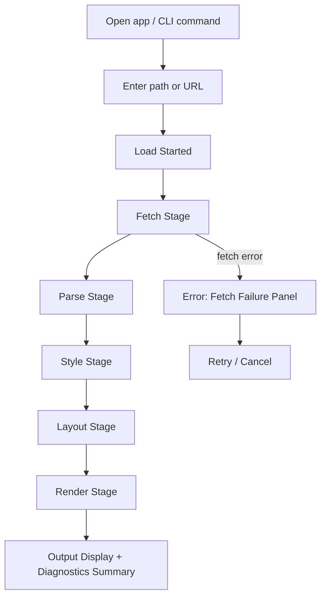
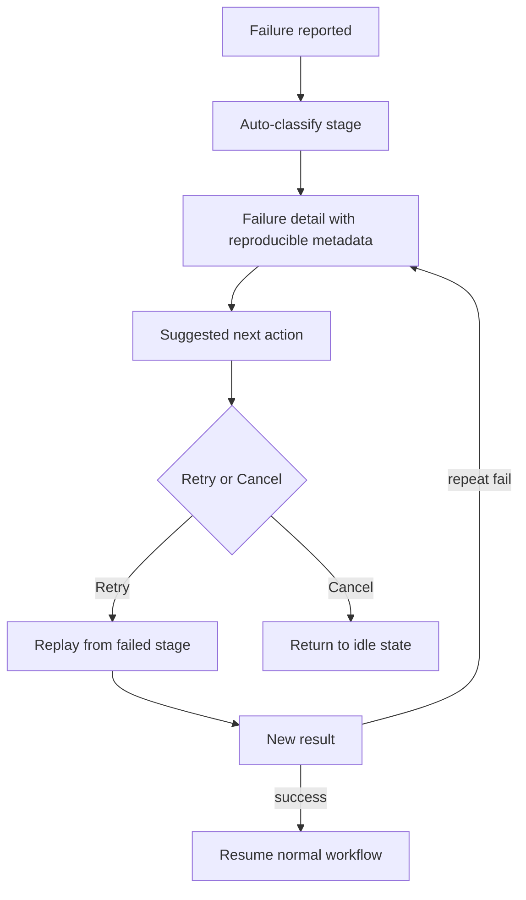
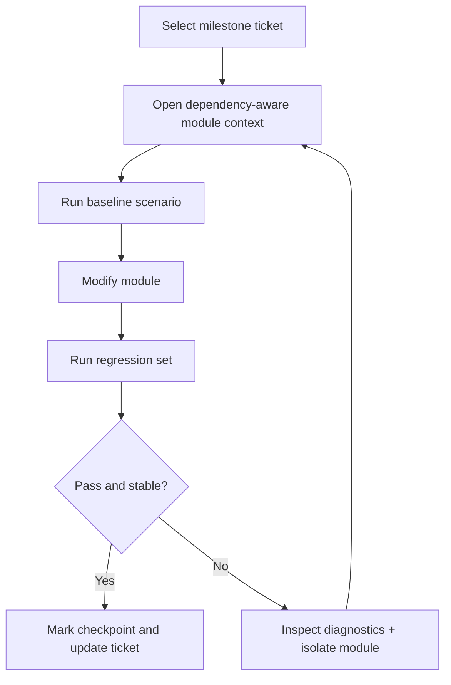
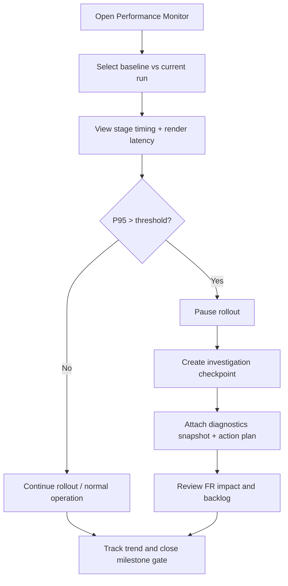

---
stepsCompleted:
  - 1
  - 2
  - 3
  - 4
  - 5
  - 6
  - 7
  - 8
  - 9
  - 10
  - 11
  - 12
  - 13
  - 14
lastStep: 14
inputDocuments:
  - _bmad-output/planning-artifacts/product-brief-vibrowser-2026-02-23.md
  - _bmad-output/planning-artifacts/prd.md
  - _bmad-output/planning-artifacts/research/market-vibrowser-research-2026-02-23.md
  - _bmad-output/planning-artifacts/research/domain-web-browser-engine-research-2026-02-22.md
  - _bmad-output/planning-artifacts/research/technical-vibrowser-research-2026-02-22.md
  - README.md
  - docs/browser_engine_mvp_backlog.md
  - docs/browser_engine_mvp_roadmap.md
date: 2026-02-23
author: BMad
project_name: vibrowser
date_completed: 2026-02-23
---

# UX Design Specification vibrowser

**Author:** BMad
**Date:** 2026-02-23

## Executive Summary

### Project Vision

`vibrowser` should feel like a trustworthy engineering tool for people who want a browser engine they can understand, debug, and extend. The UX should reinforce deterministic behavior across navigation, parsing, styling, layout, and rendering, while keeping the interaction model explicit and predictable.

The interface should support two modes naturally: a fast **CLI-first flow** for automated fixtures and contribution workflows, and a **GUI-first flow** for interactive inspection and manual validation. The most important principle is observability: every meaningful state transition should be understandable from the UI and logs.

### Target Users

- **Primary users**
  - Learning-focused C++ systems developers shipping real browser-engine features.
  - Early-stage teams building browser-embedded tooling that values reliability and maintainability over raw feature breadth.
- **Secondary users**
  - Educators and mentors teaching browser internals.
  - Open-source contributors evaluating architecture and standards risk.
  - Security/performance reviewers validating network and lifecycle boundaries.

### Key Design Challenges

1. **Confidence gap in engine behavior**: users need to trust each state transition (`fetch -> parse -> css -> layout -> render`) without guessing.
2. **Feature creep risk**: broad compatibility pressure can blur core focus and overwhelm users with complexity.
3. **Recovery clarity**: failures must be visible and actionable, not silent.
4. **Contributor onboarding friction**: users need an obvious first-success path in under ~60 minutes.

### Design Opportunities

1. Define a **single, visible lifecycle model** as the product’s main interaction anchor.
2. Make diagnostics a first-class interaction layer, not an admin add-on.
3. Build an interface that scales from deterministic CLI batch runs to interactive GUI inspection.
4. Provide progressive reveal of capabilities so contributors can contribute incrementally.

## Core User Experience

### Defining Experience

The core experience is “**Know what the engine is doing, and make it feel correct within one pass**.”

A successful user session is one where a URL or local file path is loaded, the deterministic pipeline runs, and users receive immediate status, useful diagnostics, and output they can inspect. If a failure occurs, they understand exactly which stage failed and how to reproduce or recover.

### Platform Strategy

- **Primary platform**: Desktop-first application with native shell and CLI entry points.
- **Core interaction surfaces**:
  - URL/path input + load controls.
  - Diagnostics timeline with stage status and severity badges.
  - Render output viewport + optional debug overlays.
  - Command/history controls for repeated reproducible sessions.
- **Implementation path**: build around one state model first (desktop + CLI), with optional future mobile/web control panels.
- **Offline considerations**: consistent behavior when network is unavailable.

### Effortless Interactions

- **One-step load**: user enters path/url and gets immediate progress in one place.
- **Deterministic actions**: retry/cancel are always available and never ambiguous.
- **Consistent state feedback**: every stage has a clear label and color.
- **Low cognitive overhead**: avoid exposing deep internals unless user asks for them.

### Critical Success Moments

- First successful end-to-end run to rendered output.
- Immediate classification of any failure stage.
- Re-run reproducing the same stage transitions in equivalent order.
- Clear handoff from failure recovery to next actionable step.

### Experience Principles

1. **Predictable by default**: every action maps to a stable state transition.
2. **Visible is better than hidden**: diagnostics sit in the primary interface, not in external files only.
3. **Small, repeatable loops**: onboarding and retry flows should complete quickly.
4. **Confidence over novelty**: advanced controls only after core flow is stable.
5. **Minimalism with depth**: keep defaults simple, but keep advanced detail discoverable.

## Desired Emotional Response

### Primary Emotional Goals

Users should feel **confident, in control, and intellectually comfortable** while interacting with the engine.

### Emotional Journey Mapping

- **First contact**: calm curiosity and trust when opening the app or running first CLI command.
- **Active use**: focus and clarity while moving through lifecycle stages.
- **Success**: satisfaction and momentum when content renders and diagnostics are clean.
- **Failure states**: composure instead of frustration, because failure is explicitly classified and recoverable.
- **Return use**: assurance from predictable repetition and visible progress.

### Micro-Emotions

- Confidence vs. Uncertainty
- Clarity vs. Ambiguity
- Agency vs. Helplessness
- Ownership vs. Passive Monitoring
- Relief vs. Anxiety when handling failures

### Design Implications

- Use explicit stage progress labels to prevent uncertainty.
- Convert “silent failures” into actionable alerts.
- Provide stable feedback timing so users feel progression even on slow loads.
- Offer safe defaults: one-click retry, explicit cancel, and clear safe state afterward.

### Emotional Design Principles

1. Never leave users guessing where the engine is.
2. Reward correct action patterns (successful run, successful recoveries) with confirmation.
3. Avoid overwhelming users with raw telemetry unless requested.
4. Turn errors into guidance with likely next steps.

## UX Pattern Analysis & Inspiration

### Inspiring Products Analysis

- **Firefox/Chromium DevTools-like diagnostics**: strong model is staged, scannable instrumentation and explicit console/warning surfaces.
- **Minimal CLI build/test tooling (e.g., CMake/Make build output patterns)**: short, status-oriented text output with clear pass/fail boundaries.
- **Developer utilities with trace panels**: command logs, structured messages, and filtering by severity.

### Transferable UX Patterns

- **Navigation Patterns**: top-level action bar + clearly labeled command actions (Load, Reload, Cancel).
- **Interaction Patterns**: staged timeline with collapsible detail; drill-down on errors only.
- **Visual Patterns**: strong card-based modules for pipeline stage, render state, network state, and resource timing.

### Anti-Patterns to Avoid

- Overloading all logs into one unfiltered stream from first screen.
- Unlabelled spinners without stage context.
- Requiring users to inspect multiple files/tools for baseline troubleshooting.
- Mixed success/failure signals using one color vocabulary.

### Design Inspiration Strategy

- **Adopt**: staged pipeline framing, explicit severity indicators, compact summary-first pattern.
- **Adapt**: preserve C++ tooling context by using terminal-like optional outputs and compact panel density.
- **Avoid**: any interface assumption that implies enterprise-level browser parity immediately.

## Design System Foundation

### 1.1 Design System Choice

**Chosen approach: Themeable internal design system with explicit component tokens.**

Rationale: the project is productized around a constrained desktop/developer domain. A pure third-party web design system is not a natural fit, and a fully custom system without shared tokens increases maintenance risk.

### Rationale for Selection

- Faster consistency across CLI-linked and GUI-linked workflows.
- Reduced coupling: components defined by local tokens and behavior contracts.
- Easier to evolve as additional product surfaces emerge.

### Implementation Approach

- Establish shared design tokens for color, spacing, typography, radius, elevation, borders, focus, and state.
- Define canonical components: StatusCard, StageChip, DiagnosticsRow, ActionButton, ErrorCallout, RenderViewportFrame.
- Create one component inventory for desktop shell and one API mapping for future web or plugin surfaces.

### Customization Strategy

- Keep default style conservative and high-contrast for technical users.
- Expose optional “Focus mode” and “Compact mode” variants by token overrides.
- Allow feature flags to reveal experimental visual elements (hover overlays, advanced trace lanes).

## Core User Experience

### 2.1 Defining Experience

The defining experience is a **single successful render cycle** plus traceable recovery when anything diverges. If users only learn one concept after first use, it should be: _load → stage by stage pipeline visibility → rendered output or explicit failure explanation._

### 2.2 User Mental Model

Users bring a browser mental model from standard web workflows, but this tool’s primary promise is observability. Their expectation is that the app behaves as a “small, reliable engine,” not a full platform browser.

- They expect deterministic responses after stable code changes.
- They expect navigation and parse stages to be explicitly named and ordered.
- They expect manual control for retries and clear recovery for malformed input.

### 2.3 Success Criteria

- Load starts with visible stage state within 1 second.
- Diagnostic records include source module (net, parser, css, layout, render) and severity.
- Retry/resume actions recover to a known safe state.
- Repeated loads of unchanged input produce stable, predictable output.

### 2.4 Novel UX Patterns

Most core interactions use established control patterns; novelty is mainly in **diagnostic density** and **pipeline-first presentation**.

- Novelty element: a unified lifecycle timeline that merges CLI and GUI mental model.
- Existing user model: familiar URL/path input and button controls.

### 2.5 Experience Mechanics

- **Initiation:** user enters URL/path and presses Load.
- **Interaction:** pipeline begins and displays a per-stage card sequence.
- **Feedback:** each stage emits status chips (`in_progress`, `ok`, `warning`, `error`).
- **Completion:** render viewport updates and summary row reports timings plus warning count.
- **Recovery:** Cancel and Retry reset only the active pipeline; state remains inspectable.

## Visual Design Foundation

### Color System

#### Primary Theme (Default)

- **Background**: `#0B1020` (canvas), `#11192E` (panel), `#18233E` (card).
- **Text**: `#EAF1FF` (primary), `#B8C5E5` (secondary).
- **Action**: `#4EA8FF` (primary), `#6EE7B7` (success), `#F59E0B` (warning), `#F87171` (error).

#### Supporting Palette

- **Borders/dividers**: `#2D3A5A`
- **Links/highlights**: `#82CFFF`
- **Diagnostic neutral**: `#CBD5E1`

#### Accessibility Mapping

Contrast goals prioritize readability over aesthetics: text/background ratios should satisfy WCAG AA for normal text at least.

### Typography System

- **Primary typeface**: Inter (UI body and labels).
- **Monospace typeface**: JetBrains Mono for path strings, log lines, and console snippets.
- **Scale**:
  - H1: 22px
  - H2: 18px
  - Body: 14px
  - Label/metadata: 12px
  - Code line: 13px monospaced
- Use 1.45 line-height for body text, 1.2 for heading lines.

### Spacing & Layout Foundation

- **Base unit**: 4px.
- **Panel grid**: 12-column layout in desktop wide mode.
- **Density model**: compact by default, 16px gutters, 8px element spacing.
- **Layout principles**:
  - Keep diagnostics and viewport visually adjacent.
  - Prioritize left-to-right scan order: controls → lifecycle → output.

### Accessibility Considerations

- Minimum 44x44 touch target for clickable controls where GUI input is supported.
- High contrast focus outlines for all interactive controls.
- Keyboard equivalents for every clickable action (Load, Reload, Retry, Cancel).

## Design Direction Decision

### Design Directions Explored

1. **Terminal-First Instrumentation**: strong textual diagnostics and compact cards.
2. **Chromeless Canvas with Floating Panels**: clean render-first workspace with overlays.
3. **Developer Console Workspace**: explicit left-right split between controls and diagnostics + render pane.
4. **Minimal App Shell**: reduced chrome with fewer controls, expanded defaults in detail pane.
5. **Feature-Gated Power UI**: progressive disclosure of advanced controls by role.
6. **CLI-First with Secondary GUI Debug**: strongest for contributor flow but weaker for first visual inspection.

### Chosen Direction

**Hybrid “Developer Workspace” direction** combining 1, 3, and 5:

- Keep **Pipeline + Diagnostics** as always-visible primary context.
- Keep **Render Viewport** visually central.
- Hide advanced tabs behind an inspection toggle.
- Prioritize keyboard shortcuts and compact layout while preserving GUI-first recovery controls.

### Design Rationale

This direction best supports the project’s positioning: a narrow, reliable engine with strong pedagogy and contributor velocity. It reinforces the strongest user value—determinism and debug transparency—without overcommitting to full browser parity visuals.

### Implementation Approach

- Build top-level shell with three vertical regions: Controls, Lifecycle/Diagnostics, Render + Detail.
- Implement role-based progressive disclosure (“Standard” and “Advanced”).
- Preserve consistent spacing tokens and state chips across all modules.

## User Journey Flows

### Journey 1: Onboard and Render Baseline Fixture

**Goal:** produce one successful full pipeline render in minimal steps.



### Journey 2: Debug and Recover from Failure



### Journey 3: Extend Engine via Ticket-driven Change



### Journey 4: Configure Privacy and Telemetry Consent

**Goal:** ensure optional data collection is opt-in, explicit, and auditable before enabling.

```mermaid
flowchart TD
  A[Open Preferences] --> B[Security & Privacy panel]
  B --> C[Review data handling policy]
  C --> D{Enable telemetry?}
  D -->|No| E[Keep defaults (opt-out)]
  D -->|Yes| F[Show consent form + retention scope]
  F --> G[Confirm policy and enable controls]
  E --> H[Session proceeds with data minimization]
  G --> I[Session proceeds with logged consent and controls]
  H --> J[Run load with privacy-safe defaults]
  I --> J
  J --> K[Display policy banner + audit link in diagnostics]
```

### Journey 5: Monitor Runtime Performance and Decide Rollout

**Goal:** detect and act on performance regressions using the same operational workflow as normal runs.



### Journey Patterns

- **Navigation pattern**: explicit stage-based progress with retry from current stage.
- **Decision pattern**: clear branch at stage boundaries for recovery or continuation.
- **Feedback pattern**: summary first, details-on-demand.

### Flow Optimization Principles

- Keep onboarding path to first successful render shortest.
- Auto-surface the most probable failure cause for each stage.
- Preserve state history long enough to compare two consecutive runs.

## Component Strategy

### Design System Components

#### Foundation Components (from chosen design system)

- `PrimaryActionButton`
- `SecondaryActionButton`
- `StageChip`
- `DiagnosticRow`
- `PanelCard`
- `StatusSummaryBanner`
- `ViewportCanvas`

### Custom Components

#### PipelineStageCard

- **Purpose:** show current and previous engine stages with status.
- **Usage:** always visible in GUI mode, compact in standard mode.
- **Anatomy:** title, icon, stage name, progress, elapsed, status color.
- **States:** idle, running, success, warning, failed.
- **Variants:** standard, compact, expanded.
- **Accessibility:** role=region, aria-label include stage name and state.

#### TraceEntry

- **Purpose:** expose detailed structured diagnostics.
- **Usage:** within diagnostics pane.
- **Anatomy:** timestamp, source module, severity, message, correlation id.
- **States:** info, warning, error.
- **Variants:** collapsed, expanded.
- **Accessibility:** keyboard navigation and row text semantics.

#### RenderViewportFrame

- **Purpose:** present rendered output with status overlays.
- **Usage:** center workflow pane.
- **Anatomy:** output surface, coordinate legend, status overlay.
- **States:** loading, rendered, empty, error.
- **Variants:** normal, detached inspector mode.
- **Accessibility:** meaningful alt labels for saved diagnostics snapshots.

#### RecoveryActionBar

- **Purpose:** provide retry/cancel/clear actions for current run.
- **Usage:** shown during active sessions and failure states.
- **States:** active, disabled, processing.

### Component Implementation Strategy

- Define every custom component as a tokenized shell-level wrapper to keep behavior portable across CLI and future GUI toolkit choices.
- Ensure diagnostics components can render both as rich cards and as plain text output.
- Build from composition: each higher-level component uses smaller composable atoms.

### Implementation Roadmap

- **Phase 1 (Critical)**: PipelineStageCard, DiagnosticRow, RecoveryActionBar.
- **Phase 2 (Stability)**: TraceEntry timeline, ViewportFrame overlays.
- **Phase 3 (Optimization)**: Compact mode and advanced filters, component-level theming.

## UX Consistency Patterns

### Button Hierarchy

- Primary actions: Load/Retry.
- Secondary actions: Cancel/Clear.
- Tertiary actions: Toggle detail and export diagnostics.
- Disabled states should be muted but still announced with explanation.

### Feedback Patterns

- Primary success signal: green status chip and brief completion line.
- Error signals: high-contrast red, clear cause + recommended action.
- Warning signals: amber line with optional ignore/inspect.
- Recovery confirmation: success banner when retry leads to completion.

### Form Patterns

- Input must provide placeholder examples and validation hints.
- URL/path input should validate scheme/path format before starting load.
- On Enter keypress, trigger same behavior as Load.

### Navigation Patterns

- One-click backtrack to last completed stable stage (where safe).
- Breadcrumb-like stage path in title bar (Fetch > Parse > CSS > Layout > Render).
- Keyboard shortcuts for frequent actions: `Ctrl+R` refresh, `Ctrl+.` cancel, `Ctrl+L` load.

### Additional Patterns

- **Diagnostic Sorting**: default by severity, then timestamp descending.
- **Progressive Disclosure**: summary first, detailed trace on demand.
- **Copy/Paste Safety**: structured logs available for reporting with one click.
- **Session Safety**: never clear previous successful summary until new run starts.

## Responsive Design & Accessibility

### Responsive Strategy

- **Desktop-first baseline**: primary product surface for contributors and architecture-level users.
- **Desktop behavior:** multi-panel layout with side-by-side diagnostics and viewport.
- **Tablet behavior:** single-column stacking with collapse panels.
- **Mobile behavior:** CLI and status summary remain usable; GUI expected limited and optional.

### Breakpoint Strategy

- `320px - 767px`: stacked minimal mode, no split diagnostics by default.
- `768px - 1023px`: two-tier compact mode, one advanced panel at a time.
- `1024px+`: full three-region layout.

### Accessibility Strategy

- Target **WCAG 2.1 AA** as minimum.
- Keyboard-first operation for core actions in all surfaces.
- Clear focus state for all controls.
- Maintain color contrast for all status tokens on both dark themes and high-contrast mode.
- Provide text alternatives where visuals convey critical state.

### Testing Strategy

#### Responsive Testing

- Browser/desktop window resize checks at three breakpoints.
- Render correctness under 1200px, 1366px, 1920px widths.
- Low-memory/low-dpi simulation for text and control clipping.

#### Accessibility Testing

- Axe/Pa11y style checks on rendered HTML debug panels.
- Keyboard-only navigation script for all action paths.
- High contrast/manual inspect on status and diagnostics surfaces.

### Implementation Guidelines

- Use relative units (`rem`, `%`, `clamp`) for UI sizing.
- Prefer semantic structure over custom role-only markup.
- Ensure touch-friendly targets and spacing tokens.
- Explicit high-contrast mode that increases border and text contrast.

### Workflow Completion and Completion Record

- UX design workflow completed with all steps saved.
- Design specification file ready: `_bmad-output/planning-artifacts/ux-design-specification.md`.
- Supporting assets created:
  - `_bmad-output/planning-artifacts/ux-color-themes.html`
  - `_bmad-output/planning-artifacts/ux-design-directions.html`

### Suggested Next-Step Sequence

1. Wireframe generation from sections and component strategy.
2. Prototype primary screens (pipeline/status + viewport).
3. Finalize architecture interface contracts and map to screen behaviors.
4. Begin implementation with PRD-critical journey flows first.
